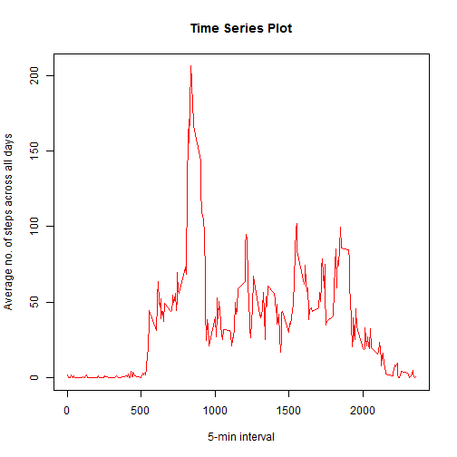
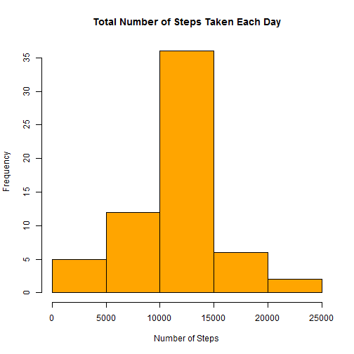
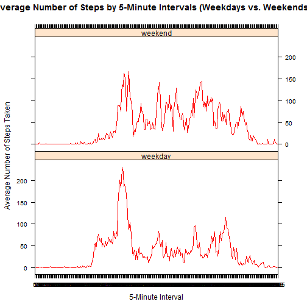

**Declaring the Libraries that are required**


```r
library(lattice)
```

**Read the activity.csv file if it is present in the local directory.**


```r
if(!exists("activity.csv")){
        activitylist <- read.csv('activity.csv',na.strings = c("NA"))
        
}
```

**Basic Analysis to check the data**


```r
summary(activitylist)
```

```
##      steps                date          interval     
##  Min.   :  0.00   2012-10-01:  288   Min.   :   0.0  
##  1st Qu.:  0.00   2012-10-02:  288   1st Qu.: 588.8  
##  Median :  0.00   2012-10-03:  288   Median :1177.5  
##  Mean   : 37.38   2012-10-04:  288   Mean   :1177.5  
##  3rd Qu.: 12.00   2012-10-05:  288   3rd Qu.:1766.2  
##  Max.   :806.00   2012-10-06:  288   Max.   :2355.0  
##  NA's   :2304     (Other)   :15840
```

```r
head(activitylist)
```

```
##   steps       date interval
## 1    NA 2012-10-01        0
## 2    NA 2012-10-01        5
## 3    NA 2012-10-01       10
## 4    NA 2012-10-01       15
## 5    NA 2012-10-01       20
## 6    NA 2012-10-01       25
```

```r
tail(activitylist)
```

```
##       steps       date interval
## 17563    NA 2012-11-30     2330
## 17564    NA 2012-11-30     2335
## 17565    NA 2012-11-30     2340
## 17566    NA 2012-11-30     2345
## 17567    NA 2012-11-30     2350
## 17568    NA 2012-11-30     2355
```

```r
str(activitylist)
```

```
## 'data.frame':	17568 obs. of  3 variables:
##  $ steps   : int  NA NA NA NA NA NA NA NA NA NA ...
##  $ date    : Factor w/ 61 levels "2012-10-01","2012-10-02",..: 1 1 1 1 1 1 1 1 1 1 ...
##  $ interval: int  0 5 10 15 20 25 30 35 40 45 ...
```

**There are 3 columns - Steps, date and interval. The steps column contains "NAs" , Data is taken over of 2 month period from October 2012 to November 2012 (61 days ) and the interval timeframe is from morning till night for every 5 mins.** 

**Transforming the data into a format suitable for our Analysis**

**Date values are converted from factor format to date format and interval is converted from int format to factor format.** 


```r
activitylist$date = as.Date(activitylist$date, format = "%Y-%m-%d")
activitylist$interval = as.factor(activitylist$interval)
str(activitylist)
```

```
## 'data.frame':	17568 obs. of  3 variables:
##  $ steps   : int  NA NA NA NA NA NA NA NA NA NA ...
##  $ date    : Date, format: "2012-10-01" "2012-10-01" ...
##  $ interval: Factor w/ 288 levels "0","5","10","15",..: 1 2 3 4 5 6 7 8 9 10 ...
```

**Creating a Data by Omitting the 'NA' rows**


```r
alistNA <- na.omit(activitylist)
head(alistNA)
```

```
##     steps       date interval
## 289     0 2012-10-02        0
## 290     0 2012-10-02        5
## 291     0 2012-10-02       10
## 292     0 2012-10-02       15
## 293     0 2012-10-02       20
## 294     0 2012-10-02       25
```


**To find total number of steps taken per day **

```r
stepsperday<- tapply(alistNA$steps, alistNA$date, sum)
stepsperday
```

```
## 2012-10-02 2012-10-03 2012-10-04 2012-10-05 2012-10-06 2012-10-07 
##        126      11352      12116      13294      15420      11015 
## 2012-10-09 2012-10-10 2012-10-11 2012-10-12 2012-10-13 2012-10-14 
##      12811       9900      10304      17382      12426      15098 
## 2012-10-15 2012-10-16 2012-10-17 2012-10-18 2012-10-19 2012-10-20 
##      10139      15084      13452      10056      11829      10395 
## 2012-10-21 2012-10-22 2012-10-23 2012-10-24 2012-10-25 2012-10-26 
##       8821      13460       8918       8355       2492       6778 
## 2012-10-27 2012-10-28 2012-10-29 2012-10-30 2012-10-31 2012-11-02 
##      10119      11458       5018       9819      15414      10600 
## 2012-11-03 2012-11-05 2012-11-06 2012-11-07 2012-11-08 2012-11-11 
##      10571      10439       8334      12883       3219      12608 
## 2012-11-12 2012-11-13 2012-11-15 2012-11-16 2012-11-17 2012-11-18 
##      10765       7336         41       5441      14339      15110 
## 2012-11-19 2012-11-20 2012-11-21 2012-11-22 2012-11-23 2012-11-24 
##       8841       4472      12787      20427      21194      14478 
## 2012-11-25 2012-11-26 2012-11-27 2012-11-28 2012-11-29 
##      11834      11162      13646      10183       7047
```

**Histogram on total number of steps taken per day**


```r
hist(stepsperday, col="orange",
     xlab="Number of Steps",
     ylab = "Frequency",
     main="Total Number of Steps Taken Each Day")
```


**Mean of the total steps taken per day**

```r
meanstepsperday <- mean(stepsperday)
meanstepsperday
```

```
## [1] 10766.19
```

**Median of the total steps taken per day**

```r
medianstepsperday <- median(stepsperday)
medianstepsperday
```

```
## [1] 10765
```


**To find Average no. steps taken across all days **

```r
avgstepsperday<- tapply(alistNA$steps, alistNA$interval, mean)
avgstepsperday
```

```
##           0           5          10          15          20          25 
##   1.7169811   0.3396226   0.1320755   0.1509434   0.0754717   2.0943396 
##          30          35          40          45          50          55 
##   0.5283019   0.8679245   0.0000000   1.4716981   0.3018868   0.1320755 
##         100         105         110         115         120         125 
##   0.3207547   0.6792453   0.1509434   0.3396226   0.0000000   1.1132075 
##         130         135         140         145         150         155 
##   1.8301887   0.1698113   0.1698113   0.3773585   0.2641509   0.0000000 
##         200         205         210         215         220         225 
##   0.0000000   0.0000000   1.1320755   0.0000000   0.0000000   0.1320755 
##         230         235         240         245         250         255 
##   0.0000000   0.2264151   0.0000000   0.0000000   1.5471698   0.9433962 
##         300         305         310         315         320         325 
##   0.0000000   0.0000000   0.0000000   0.0000000   0.2075472   0.6226415 
##         330         335         340         345         350         355 
##   1.6226415   0.5849057   0.4905660   0.0754717   0.0000000   0.0000000 
##         400         405         410         415         420         425 
##   1.1886792   0.9433962   2.5660377   0.0000000   0.3396226   0.3584906 
##         430         435         440         445         450         455 
##   4.1132075   0.6603774   3.4905660   0.8301887   3.1132075   1.1132075 
##         500         505         510         515         520         525 
##   0.0000000   1.5660377   3.0000000   2.2452830   3.3207547   2.9622642 
##         530         535         540         545         550         555 
##   2.0943396   6.0566038  16.0188679  18.3396226  39.4528302  44.4905660 
##         600         605         610         615         620         625 
##  31.4905660  49.2641509  53.7735849  63.4528302  49.9622642  47.0754717 
##         630         635         640         645         650         655 
##  52.1509434  39.3396226  44.0188679  44.1698113  37.3584906  49.0377358 
##         700         705         710         715         720         725 
##  43.8113208  44.3773585  50.5094340  54.5094340  49.9245283  50.9811321 
##         730         735         740         745         750         755 
##  55.6792453  44.3207547  52.2641509  69.5471698  57.8490566  56.1509434 
##         800         805         810         815         820         825 
##  73.3773585  68.2075472 129.4339623 157.5283019 171.1509434 155.3962264 
##         830         835         840         845         850         855 
## 177.3018868 206.1698113 195.9245283 179.5660377 183.3962264 167.0188679 
##         900         905         910         915         920         925 
## 143.4528302 124.0377358 109.1132075 108.1132075 103.7169811  95.9622642 
##         930         935         940         945         950         955 
##  66.2075472  45.2264151  24.7924528  38.7547170  34.9811321  21.0566038 
##        1000        1005        1010        1015        1020        1025 
##  40.5660377  26.9811321  42.4150943  52.6603774  38.9245283  50.7924528 
##        1030        1035        1040        1045        1050        1055 
##  44.2830189  37.4150943  34.6981132  28.3396226  25.0943396  31.9433962 
##        1100        1105        1110        1115        1120        1125 
##  31.3584906  29.6792453  21.3207547  25.5471698  28.3773585  26.4716981 
##        1130        1135        1140        1145        1150        1155 
##  33.4339623  49.9811321  42.0377358  44.6037736  46.0377358  59.1886792 
##        1200        1205        1210        1215        1220        1225 
##  63.8679245  87.6981132  94.8490566  92.7735849  63.3962264  50.1698113 
##        1230        1235        1240        1245        1250        1255 
##  54.4716981  32.4150943  26.5283019  37.7358491  45.0566038  67.2830189 
##        1300        1305        1310        1315        1320        1325 
##  42.3396226  39.8867925  43.2641509  40.9811321  46.2452830  56.4339623 
##        1330        1335        1340        1345        1350        1355 
##  42.7547170  25.1320755  39.9622642  53.5471698  47.3207547  60.8113208 
##        1400        1405        1410        1415        1420        1425 
##  55.7547170  51.9622642  43.5849057  48.6981132  35.4716981  37.5471698 
##        1430        1435        1440        1445        1450        1455 
##  41.8490566  27.5094340  17.1132075  26.0754717  43.6226415  43.7735849 
##        1500        1505        1510        1515        1520        1525 
##  30.0188679  36.0754717  35.4905660  38.8490566  45.9622642  47.7547170 
##        1530        1535        1540        1545        1550        1555 
##  48.1320755  65.3207547  82.9056604  98.6603774 102.1132075  83.9622642 
##        1600        1605        1610        1615        1620        1625 
##  62.1320755  64.1320755  74.5471698  63.1698113  56.9056604  59.7735849 
##        1630        1635        1640        1645        1650        1655 
##  43.8679245  38.5660377  44.6603774  45.4528302  46.2075472  43.6792453 
##        1700        1705        1710        1715        1720        1725 
##  46.6226415  56.3018868  50.7169811  61.2264151  72.7169811  78.9433962 
##        1730        1735        1740        1745        1750        1755 
##  68.9433962  59.6603774  75.0943396  56.5094340  34.7735849  37.4528302 
##        1800        1805        1810        1815        1820        1825 
##  40.6792453  58.0188679  74.6981132  85.3207547  59.2641509  67.7735849 
##        1830        1835        1840        1845        1850        1855 
##  77.6981132  74.2452830  85.3396226  99.4528302  86.5849057  85.6037736 
##        1900        1905        1910        1915        1920        1925 
##  84.8679245  77.8301887  58.0377358  53.3584906  36.3207547  20.7169811 
##        1930        1935        1940        1945        1950        1955 
##  27.3962264  40.0188679  30.2075472  25.5471698  45.6603774  33.5283019 
##        2000        2005        2010        2015        2020        2025 
##  19.6226415  19.0188679  19.3396226  33.3396226  26.8113208  21.1698113 
##        2030        2035        2040        2045        2050        2055 
##  27.3018868  21.3396226  19.5471698  21.3207547  32.3018868  20.1509434 
##        2100        2105        2110        2115        2120        2125 
##  15.9433962  17.2264151  23.4528302  19.2452830  12.4528302   8.0188679 
##        2130        2135        2140        2145        2150        2155 
##  14.6603774  16.3018868   8.6792453   7.7924528   8.1320755   2.6226415 
##        2200        2205        2210        2215        2220        2225 
##   1.4528302   3.6792453   4.8113208   8.5094340   7.0754717   8.6981132 
##        2230        2235        2240        2245        2250        2255 
##   9.7547170   2.2075472   0.3207547   0.1132075   1.6037736   4.6037736 
##        2300        2305        2310        2315        2320        2325 
##   3.3018868   2.8490566   0.0000000   0.8301887   0.9622642   1.5849057 
##        2330        2335        2340        2345        2350        2355 
##   2.6037736   4.6981132   3.3018868   0.6415094   0.2264151   1.0754717
```

```r
names(avgstepsperday)
```

```
##   [1] "0"    "5"    "10"   "15"   "20"   "25"   "30"   "35"   "40"   "45"  
##  [11] "50"   "55"   "100"  "105"  "110"  "115"  "120"  "125"  "130"  "135" 
##  [21] "140"  "145"  "150"  "155"  "200"  "205"  "210"  "215"  "220"  "225" 
##  [31] "230"  "235"  "240"  "245"  "250"  "255"  "300"  "305"  "310"  "315" 
##  [41] "320"  "325"  "330"  "335"  "340"  "345"  "350"  "355"  "400"  "405" 
##  [51] "410"  "415"  "420"  "425"  "430"  "435"  "440"  "445"  "450"  "455" 
##  [61] "500"  "505"  "510"  "515"  "520"  "525"  "530"  "535"  "540"  "545" 
##  [71] "550"  "555"  "600"  "605"  "610"  "615"  "620"  "625"  "630"  "635" 
##  [81] "640"  "645"  "650"  "655"  "700"  "705"  "710"  "715"  "720"  "725" 
##  [91] "730"  "735"  "740"  "745"  "750"  "755"  "800"  "805"  "810"  "815" 
## [101] "820"  "825"  "830"  "835"  "840"  "845"  "850"  "855"  "900"  "905" 
## [111] "910"  "915"  "920"  "925"  "930"  "935"  "940"  "945"  "950"  "955" 
## [121] "1000" "1005" "1010" "1015" "1020" "1025" "1030" "1035" "1040" "1045"
## [131] "1050" "1055" "1100" "1105" "1110" "1115" "1120" "1125" "1130" "1135"
## [141] "1140" "1145" "1150" "1155" "1200" "1205" "1210" "1215" "1220" "1225"
## [151] "1230" "1235" "1240" "1245" "1250" "1255" "1300" "1305" "1310" "1315"
## [161] "1320" "1325" "1330" "1335" "1340" "1345" "1350" "1355" "1400" "1405"
## [171] "1410" "1415" "1420" "1425" "1430" "1435" "1440" "1445" "1450" "1455"
## [181] "1500" "1505" "1510" "1515" "1520" "1525" "1530" "1535" "1540" "1545"
## [191] "1550" "1555" "1600" "1605" "1610" "1615" "1620" "1625" "1630" "1635"
## [201] "1640" "1645" "1650" "1655" "1700" "1705" "1710" "1715" "1720" "1725"
## [211] "1730" "1735" "1740" "1745" "1750" "1755" "1800" "1805" "1810" "1815"
## [221] "1820" "1825" "1830" "1835" "1840" "1845" "1850" "1855" "1900" "1905"
## [231] "1910" "1915" "1920" "1925" "1930" "1935" "1940" "1945" "1950" "1955"
## [241] "2000" "2005" "2010" "2015" "2020" "2025" "2030" "2035" "2040" "2045"
## [251] "2050" "2055" "2100" "2105" "2110" "2115" "2120" "2125" "2130" "2135"
## [261] "2140" "2145" "2150" "2155" "2200" "2205" "2210" "2215" "2220" "2225"
## [271] "2230" "2235" "2240" "2245" "2250" "2255" "2300" "2305" "2310" "2315"
## [281] "2320" "2325" "2330" "2335" "2340" "2345" "2350" "2355"
```

**A time series plot of the 5-minute interval (x-axis) and the average number of steps taken, averaged across all days (y-axis)**


```r
plot(names(avgstepsperday), avgstepsperday, type="l",col="red", xlab="5-min interval", ylab="Average no. of steps across all days",main="Time Series Plot")
```



**The 5-minute interval which contains the maximum number of steps  on an average across all the days in the dataset**


```r
maxavg<- max(avgstepsperday)
maxavg
```

```
## [1] 206.1698
```

```r
maxinterval<- names(avgstepsperday)[which(avgstepsperday==max(avgstepsperday))]
maxinterval
```

```
## [1] "835"
```

**Total no of NAs in the dataset **

```r
totalna<- sum(is.na(activitylist$steps))
totalna
```

```
## [1] 2304
```

**Modify the data by imputing missing NA values from avgsteps for all days during that time interval**


```r
Modifieddata <- activitylist

for(i in which(is.na(Modifieddata$steps))) {
    #Get the NA index 
    int <- Modifieddata$interval[i]
    #get the mean value for that 5-minute interval
    avgStepsForInt <- avgstepsperday[which (names(avgstepsperday) == int )]
    #replace the NA with the mean value
    Modifieddata$steps[i] <- avgStepsForInt
}
```

**Total no of NAs in the modified dataset, // ideally this should be Zero :) //**

```r
totalna<- sum(is.na(Modifieddata$steps))
totalna
```

```
## [1] 0
```

**To find total number of steps taken per day with the modified data set**

```r
stepsperday<- tapply(Modifieddata$steps, Modifieddata$date, sum)
stepsperday
```

```
## 2012-10-01 2012-10-02 2012-10-03 2012-10-04 2012-10-05 2012-10-06 
##   10766.19     126.00   11352.00   12116.00   13294.00   15420.00 
## 2012-10-07 2012-10-08 2012-10-09 2012-10-10 2012-10-11 2012-10-12 
##   11015.00   10766.19   12811.00    9900.00   10304.00   17382.00 
## 2012-10-13 2012-10-14 2012-10-15 2012-10-16 2012-10-17 2012-10-18 
##   12426.00   15098.00   10139.00   15084.00   13452.00   10056.00 
## 2012-10-19 2012-10-20 2012-10-21 2012-10-22 2012-10-23 2012-10-24 
##   11829.00   10395.00    8821.00   13460.00    8918.00    8355.00 
## 2012-10-25 2012-10-26 2012-10-27 2012-10-28 2012-10-29 2012-10-30 
##    2492.00    6778.00   10119.00   11458.00    5018.00    9819.00 
## 2012-10-31 2012-11-01 2012-11-02 2012-11-03 2012-11-04 2012-11-05 
##   15414.00   10766.19   10600.00   10571.00   10766.19   10439.00 
## 2012-11-06 2012-11-07 2012-11-08 2012-11-09 2012-11-10 2012-11-11 
##    8334.00   12883.00    3219.00   10766.19   10766.19   12608.00 
## 2012-11-12 2012-11-13 2012-11-14 2012-11-15 2012-11-16 2012-11-17 
##   10765.00    7336.00   10766.19      41.00    5441.00   14339.00 
## 2012-11-18 2012-11-19 2012-11-20 2012-11-21 2012-11-22 2012-11-23 
##   15110.00    8841.00    4472.00   12787.00   20427.00   21194.00 
## 2012-11-24 2012-11-25 2012-11-26 2012-11-27 2012-11-28 2012-11-29 
##   14478.00   11834.00   11162.00   13646.00   10183.00    7047.00 
## 2012-11-30 
##   10766.19
```

**Histogram on total number of steps taken per day with the modified data set**


```r
hist(stepsperday, col="orange",
     xlab="Number of Steps",
     ylab = "Frequency",
     main="Total Number of Steps Taken Each Day")
```



**Mean of the total steps taken per day on the modified data set**

```r
meanstepsperday <- mean(stepsperday)
meanstepsperday
```

```
## [1] 10766.19
```

**Median of the total steps taken per day on the modified data set**

```r
medianstepsperday <- median(stepsperday)
medianstepsperday
```

```
## [1] 10766.19
```

**OBSERVATION: The median and mean got closer**

**Creating a new factor variable in the dataset with two levels - "weekday" and "weekend" indicating whether a given date is a weekday or weekend day**


```r
Modifieddata <- transform(Modifieddata, dayType = ifelse(weekdays(Modifieddata$date) %in% c("Saturday", "Sunday"), "weekend", "weekday"))
#make it a factor
Modifieddata <- transform(Modifieddata, dayType = factor(dayType))
head(Modifieddata)
```

```
##       steps       date interval dayType
## 1 1.7169811 2012-10-01        0 weekday
## 2 0.3396226 2012-10-01        5 weekday
## 3 0.1320755 2012-10-01       10 weekday
## 4 0.1509434 2012-10-01       15 weekday
## 5 0.0754717 2012-10-01       20 weekday
## 6 2.0943396 2012-10-01       25 weekday
```

**Creating a panel plot containing a time series plot with type = "l" of the 5-minute interval (x-axis) and the average number of steps taken, averaged across all weekday days and weekend days (y-axis).**


```r
plotData1 <- aggregate(steps ~ interval + dayType, data=Modifieddata, mean)
head(plotData1)
```

```
##   interval dayType      steps
## 1        0 weekday 2.25115304
## 2        5 weekday 0.44528302
## 3       10 weekday 0.17316562
## 4       15 weekday 0.19790356
## 5       20 weekday 0.09895178
## 6       25 weekday 1.59035639
```

```r
xyplot(steps ~ interval|dayType, data = plotData1,
       type = "l", layout = c(1,2),col="red",
       xlab="5-Minute Interval", ylab = "Average Number of Steps Taken",
       main="Average Number of Steps by 5-Minute Intervals (Weekdays vs. Weekends)")
```


